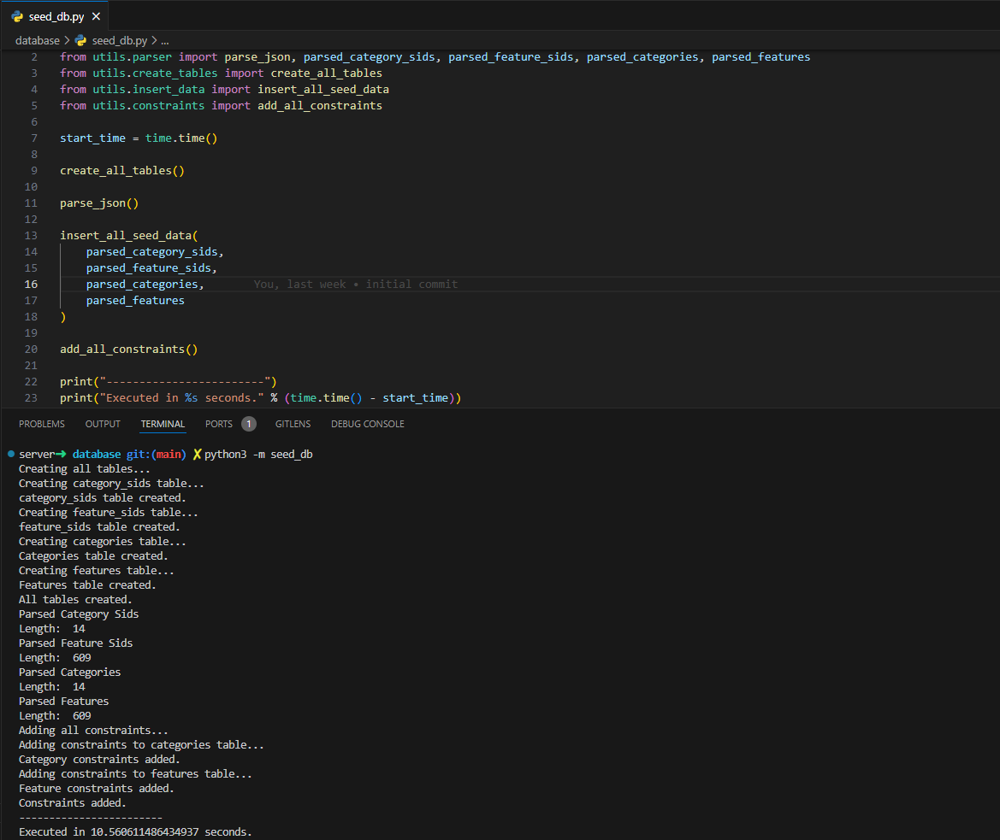

# Python script to seed AWS RDS Aurora DB

### To run:

#### Change environment variables to your credentials and RDS DB info
Create a `.env` file from `.env.example` and alter variables accordingly.

#### Run Script
```bash
python3 -m seed_db
```


